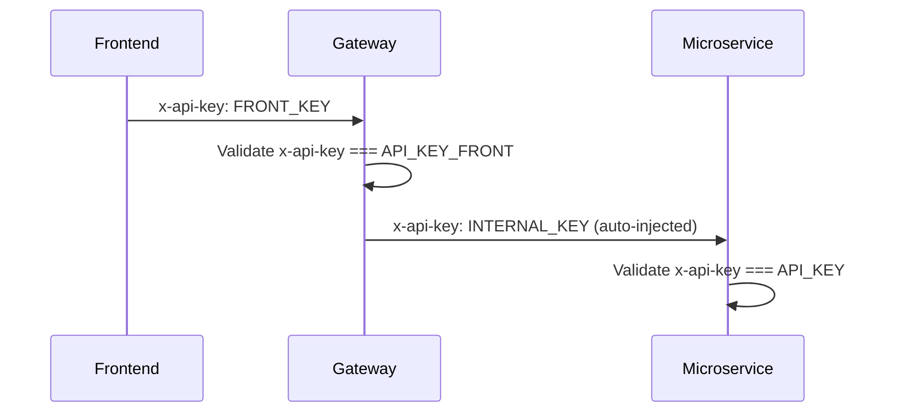

# Configuration

The gateway is configured via **environment variables** loaded from a `.env` file at the project root using `@nestjs/config`.

## Environment Variables

| Variable | Required | Default | Description |
|----------|----------|---------|-------------|
| `PORT` | Yes | `3600` | Gateway HTTP port |
| `AUTH_SERVICE_BASE_URL` | Yes | - | Auth service base URL |
| `VEHICLE_SERVICE_BASE_URL` | Yes | - | Vehicle service base URL |
| `CLIENT_SERVICE_BASE_URL` | Yes | - | Client service base URL |
| `UPLOAD_FILES_SERVICE_BASE_URL` | Yes | - | File storage service base URL |
| `RECEPTION_SERVICE_BASE_URL` | Yes | - | Form/reception service base URL |
| `API_GATEWAY_BASE_URL` | Yes | - | Gateway public URL (for generating file download links) |
| `API_KEY` | Yes | - | Internal API key for gateway-to-microservice requests |
| `API_KEY_FRONT` | Yes | - | Frontend API key for client-to-gateway requests |
| `SWAGGER_USER` | No | `admin` | Swagger UI basic auth username |
| `SWAGGER_PASS` | No | `admin` | Swagger UI basic auth password |

## Security Configuration

### API Key Flow

- **Frontend requests** carry `x-api-key` matching `API_KEY_FRONT`
- **Internal requests** automatically receive the `API_KEY` header via the Axios interceptor configured in `app.module.ts`
- Each microservice independently validates the API key before processing requests

### JWT Token Validation

- Bearer tokens are validated against the Auth Service on every protected request
- Tokens contain `userId` and `roles` for authorization decisions
- Refresh tokens are supported via the `POST /auth/refresh` public endpoint

## Swagger Documentation

Swagger UI is available at `/docs` with basic auth protection using `SWAGGER_USER` and `SWAGGER_PASS`. The OpenAPI spec includes:

- API Key security scheme (`x-api-key` header)
- Bearer token security scheme for JWT
- Endpoint descriptions, request/response examples, and DTO schemas
