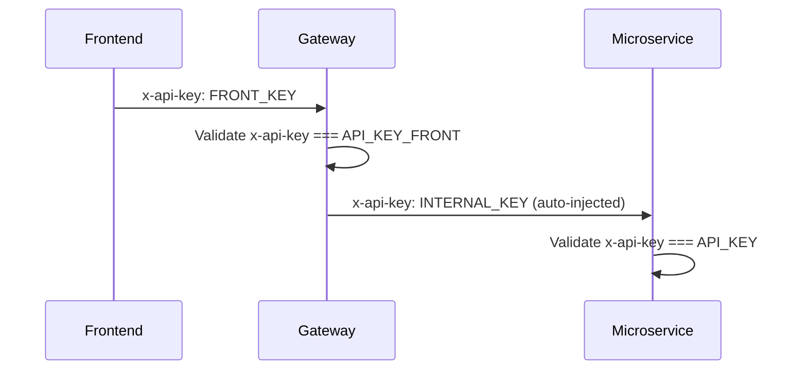

# Configuración

El gateway se configura a través de **variables de entorno** cargadas desde un archivo `.env` en la raíz del proyecto usando `@nestjs/config`.

## Variables de Entorno

| Variable | Requerida | Por Defecto | Descripción |
|----------|-----------|-------------|-------------|
| `PORT` | Sí | `3600` | Puerto HTTP del gateway |
| `AUTH_SERVICE_BASE_URL` | Sí | - | URL base del servicio de autenticación |
| `VEHICLE_SERVICE_BASE_URL` | Sí | - | URL base del servicio de vehículos |
| `CLIENT_SERVICE_BASE_URL` | Sí | - | URL base del servicio de clientes |
| `UPLOAD_FILES_SERVICE_BASE_URL` | Sí | - | URL base del servicio de almacenamiento de archivos |
| `RECEPTION_SERVICE_BASE_URL` | Sí | - | URL base del servicio de formularios/recepción |
| `API_GATEWAY_BASE_URL` | Sí | - | URL pública del gateway (para generar enlaces de descarga de archivos) |
| `API_KEY` | Sí | - | API Key interna para solicitudes gateway-to-microservice |
| `API_KEY_FRONT` | Sí | - | API Key del frontend para solicitudes client-to-gateway |
| `SWAGGER_USER` | No | `admin` | Nombre de usuario para autenticación básica de Swagger UI |
| `SWAGGER_PASS` | No | `admin` | Contraseña para autenticación básica de Swagger UI |

## Configuración de Seguridad

### Flujo de API Key

- **Solicitudes del frontend** llevan `x-api-key` que coincide con `API_KEY_FRONT`
- **Solicitudes internas** reciben automáticamente el encabezado `API_KEY` a través del interceptor Axios configurado en `app.module.ts`
- Cada microservicio valida independientemente la API Key antes de procesar las solicitudes

### Validación de Token JWT

- Los Bearer tokens se validan contra el Auth Service en cada solicitud protegida
- Los tokens contienen `userId` y `roles` para decisiones de autorización
- Los Refresh tokens son compatibles a través del endpoint público `POST /auth/refresh`

## Documentación Swagger

Swagger UI está disponible en `/docs` con protección de autenticación básica usando `SWAGGER_USER` y `SWAGGER_PASS`. La especificación OpenAPI incluye:

- Esquema de seguridad de API Key (encabezado `x-api-key`)
- Esquema de seguridad de Bearer token para JWT
- Descripciones de endpoints, ejemplos de solicitud/respuesta y esquemas de DTO
