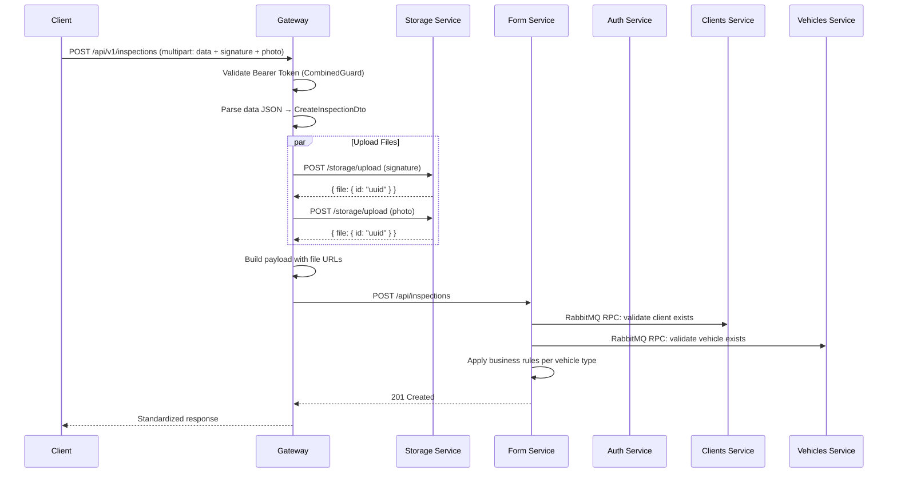
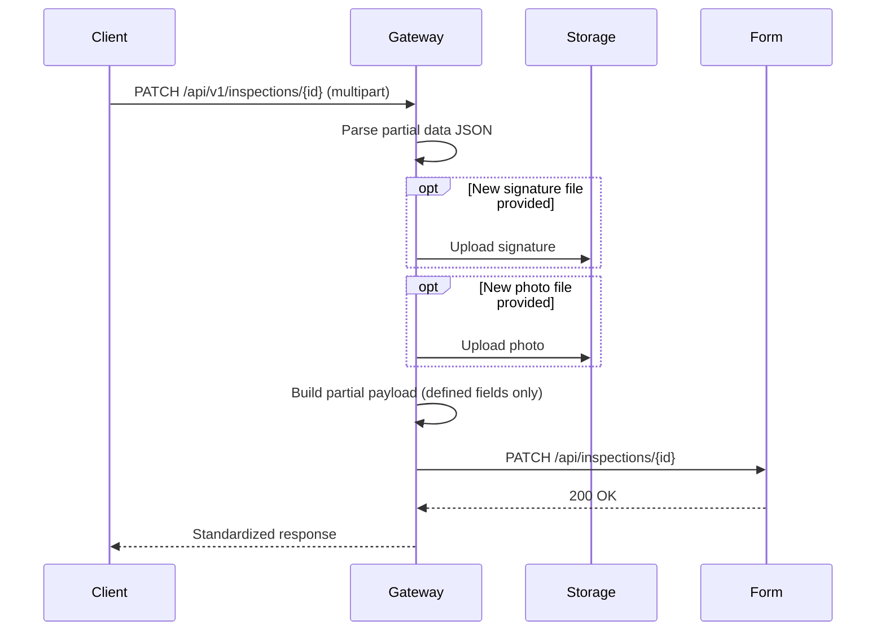
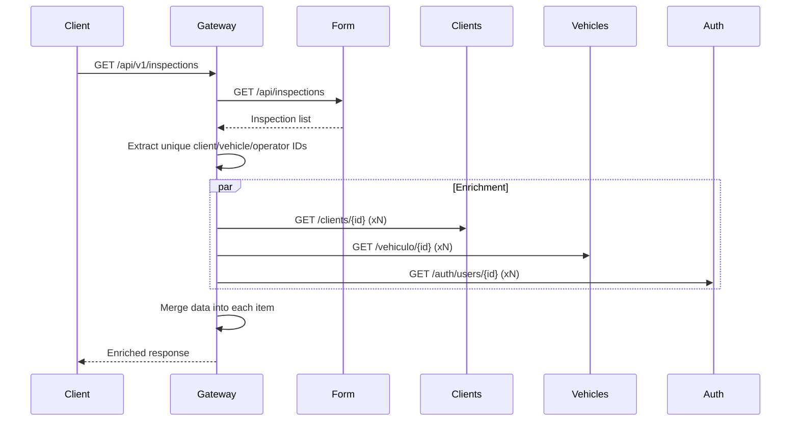
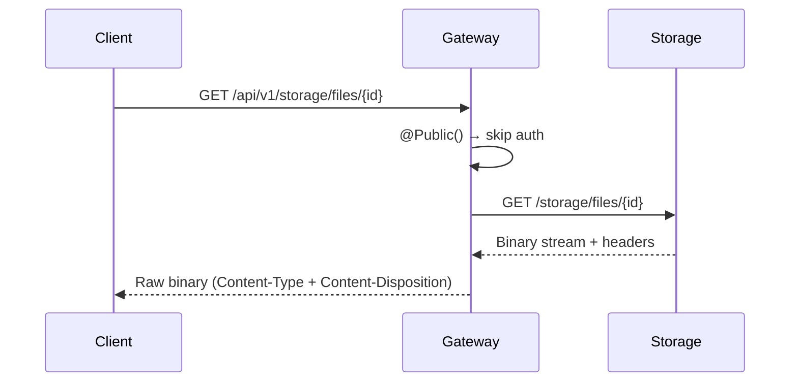
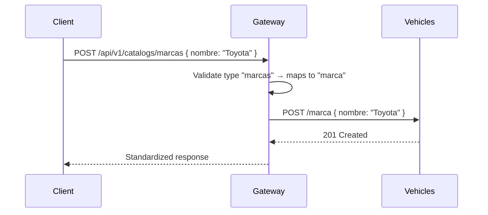
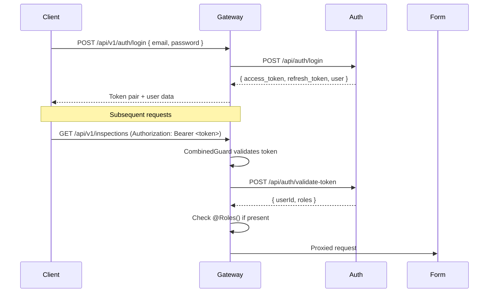

# Cómo Funciona

Esta página explica los flujos clave a través del sistema.

## 1. Flujo de Creación de Inspección

El flujo más complejo del sistema — crear una inspección de vehículo con carga de archivos.

### Detalles Clave

1. **Carga de archivos primero** — Los archivos se cargan al servicio de almacenamiento en paralelo (`forkJoin`) antes de enviar el payload de la inspección
2. **Construcción de URLs** — Las URLs de los archivos se construyen como `{API_GATEWAY_BASE_URL}/api/v1/storage/files/{id}`
3. **Filtrado de payload** — Solo los campos del DTO permitidos se incluyen en el payload (previene rechazos por `forbidNonWhitelisted`)
4. **Mapeo de operador** — `operator_id` se mapea tanto a `responsible_id` como a `customer_id`
5. **Validación de negocio** — Form-service valida la cantidad de neumáticos y la integridad del checklist según el tipo de vehículo

## 2. Flujo de Actualización de Inspección

Igual que la creación pero todos los campos son opcionales — solo los campos proporcionados se incluyen en el payload.

## 3. Listado de Inspecciones con Enriquecimiento

Al listar inspecciones, el gateway enriquece cada elemento con datos del cliente, vehículo y operador desde los servicios respectivos.

## 4. Flujo de Descarga de Archivos

Las descargas de archivos son **públicas** (no requieren autenticación) para que las fotos y firmas de las inspecciones puedan accederse a través de sus URLs.

## 5. CRUD de Catálogo Unificado

El endpoint de catálogos unificados proporciona una interfaz CRUD consistente para todos los tipos de catálogo de vehículos.

La validación de tipo rechaza tipos de catálogo inválidos con un mensaje de error descriptivo que lista las opciones válidas.

## 6. Flujo de Autenticación

## Aspectos Transversales

### Inyección de API Key
Cada solicitud saliente del gateway hacia un microservicio incluye automáticamente el encabezado `x-api-key` a través de un interceptor Axios. Cada microservicio valida esta clave antes de procesar.

### Manejo de Errores
- **Errores de conexión** → `502 Bad Gateway` con nombre del servicio
- **Errores de validación** → `400 Bad Request` con detalles
- **Errores de autenticación** → `401 Unauthorized` o `403 Forbidden`
- **No encontrado** → `404 Not Found`
