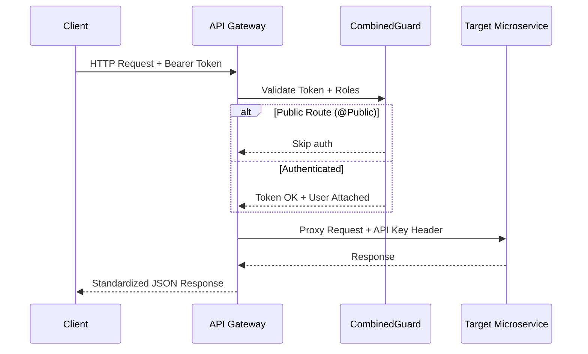

# Backend API Overview

The **API Gateway** is a [NestJS](https://nestjs.com/) application written in TypeScript. It serves as the single entry point for all client-facing HTTP requests, providing:

- **Routing & Proxying** — Forwarding requests to the appropriate microservice
- **Authentication** — JWT token validation and role-based access control
- **File Handling** — Multi-part file upload proxied to the storage service
- **Response Enrichment** — Joining data from multiple services into unified responses
- **API Key Security** — Internal service-to-service authentication

## Request Flow

## Key Design Decisions

- **Global ValidationPipe** — All incoming requests are validated with `whitelist: true` and `forbidNonWhitelisted: true`
- **Global ResponseInterceptor** — All responses are wrapped in a standard `{ statusCode, message, data, timestamp, path }` envelope
- **Global CombinedGuard** — Every route is protected unless explicitly marked with `@Public()`
- **File uploads before form submission** — Files are uploaded to the storage service first, then the resulting URLs are included in the form payload
