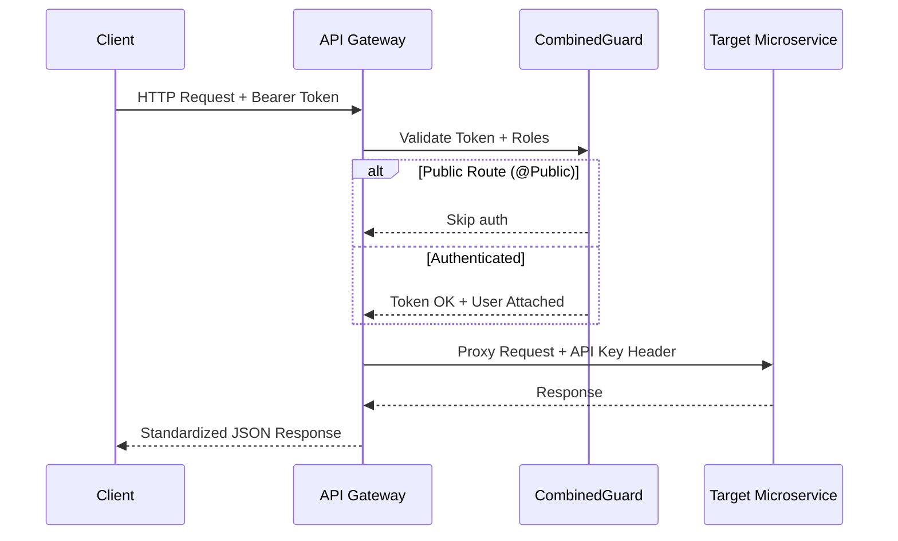

# Visión general del Backend API

El **API Gateway** es una aplicación [NestJS](https://nestjs.com/) escrita en TypeScript. Sirve como el punto de entrada único para todas las solicitudes HTTP orientadas al cliente, proporcionando:

- **Enrutamiento y Proxy** — Reenvío de solicitudes al microservicio correspondiente
- **Autenticación** — Validación de tokens JWT y control de acceso basado en roles
- **Manejo de Archivos** — Carga de archivos multiparte proxy al servicio de almacenamiento
- **Enriquecimiento de Respuestas** — Combinación de datos de múltiples servicios en respuestas unificadas
- **Seguridad con API Key** — Autenticación interna entre servicios

## Flujo de Solicitudes

## Decisiones Clave de Diseño

- **ValidationPipe global** — Todas las solicitudes entrantes se validan con `whitelist: true` y `forbidNonWhitelisted: true`
- **ResponseInterceptor global** — Todas las respuestas se envuelven en un envoltorio estándar `{ statusCode, message, data, timestamp, path }`
- **CombinedGuard global** — Cada ruta está protegida a menos que esté marcada explícitamente con `@Public()`
- **Carga de archivos antes del envío del formulario** — Los archivos se cargan primero al servicio de almacenamiento, luego las URLs resultantes se incluyen en el payload del formulario
