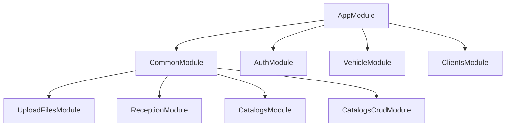

# Modules

The gateway follows NestJS modular architecture. All modules are registered through the root `AppModule`.

## Module Dependency Graph

## Module Registry

### AppModule (Root)

**File:** `src/app.module.ts`

The root module that bootstraps the application. Imports all feature modules and registers the global `CombinedGuard`. Also configures the Axios interceptor for internal API key injection.

### CommonModule

**File:** `src/common/common.module.ts`

Marked with `@Global()`, this module provides shared infrastructure across the application:

| Import | Description |
|--------|-------------|
| `HttpModule` | Axios-based HTTP client for proxying requests |
| `ConfigModule` | Environment variable loading via `@nestjs/config` |
| `UploadFilesModule` | File upload and download endpoints |
| `ReceptionModule` | Vehicle inspection reception endpoints |
| `CatalogsModule` | Read-only enum catalog endpoints (from form-service) |
| `CatalogsCrudModule` | CRUD catalog endpoints (from vehicle service) |

**Providers:** `TokenValidationService`

### AuthModule

**File:** `src/auth/auth.module.ts`

Handles authentication proxying (login, register, validate-token, refresh, logout, user management).

### VehicleModule

**File:** `src/vehicle/vehicle.module.ts`

Vehicle CRUD operations and catalog management (brands, lines, colors, classes, types).

### ClientsModule

**File:** `src/clients/clients.module.ts`

Client CRUD operations and document/person type catalogs.

### UploadFilesModule

**File:** `src/upload-files/upload-files.module.ts`

File upload, download, listing, and soft-deletion proxied to the storage service.

### ReceptionModule

**File:** `src/reception/reception.module.ts`

Vehicle inspection form creation, listing, and management proxied to the form service.

### CatalogsModule

**File:** `src/catalogs/catalogs.module.ts`

Read-only catalog endpoints for enum values (vehicle types, fuel types, etc.) proxied to the form service.

### CatalogsCrudModule

**File:** `src/catalogs-crud/catalogs-crud.module.ts`

Unified CRUD for vehicle catalogs (marcas, clases, lineas, colores, tipos-*) proxied to the vehicle service.
