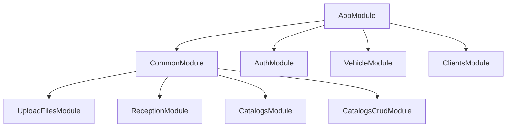

# Módulos

El gateway sigue la arquitectura modular de NestJS. Todos los módulos se registran a través del `AppModule` raíz.

## Grafo de Dependencias de Módulos

## Registro de Módulos

### AppModule (Raíz)

**Archivo:** `src/app.module.ts`

El módulo raíz que inicia la aplicación. Importa todos los módulos de funcionalidad y registra el `CombinedGuard` global. También configura el interceptor Axios para la inyección interna de API Key.

### CommonModule

**Archivo:** `src/common/common.module.ts`

Marcado con `@Global()`, este módulo proporciona infraestructura compartida en toda la aplicación:

| Importación | Descripción |
|-------------|-------------|
| `HttpModule` | Cliente HTTP basado en Axios para proxy de solicitudes |
| `ConfigModule` | Carga de variables de entorno a través de `@nestjs/config` |
| `UploadFilesModule` | Endpoints de carga y descarga de archivos |
| `ReceptionModule` | Endpoints de recepción de inspección de vehículos |
| `CatalogsModule` | Endpoints de catálogo enum de solo lectura (desde form-service) |
| `CatalogsCrudModule` | Endpoints de catálogo CRUD (desde vehicle service) |

**Providers:** `TokenValidationService`

### AuthModule

**Archivo:** `src/auth/auth.module.ts`

Maneja el proxy de autenticación (login, register, validate-token, refresh, logout, gestión de usuarios).

### VehicleModule

**Archivo:** `src/vehicle/vehicle.module.ts`

Operaciones CRUD de vehículos y gestión de catálogos (marcas, líneas, colores, clases, tipos).

### ClientsModule

**Archivo:** `src/clients/clients.module.ts`

Operaciones CRUD de clientes y catálogos de tipos de documento/persona.

### UploadFilesModule

**Archivo:** `src/upload-files/upload-files.module.ts`

Carga, descarga, listado y eliminación suave de archivos proxy al servicio de almacenamiento.

### ReceptionModule

**Archivo:** `src/reception/reception.module.ts`

Creación, listado y gestión de formularios de inspección de vehículos proxy al form service.

### CatalogsModule

**Archivo:** `src/catalogs/catalogs.module.ts`

Endpoints de catálogo de solo lectura para valores enum (tipos de vehículo, tipos de combustible, etc.) proxy al form service.

### CatalogsCrudModule

**Archivo:** `src/catalogs-crud/catalogs-crud.module.ts`

CRUD unificado para catálogos de vehículos (marcas, clases, lineas, colores, tipos-*) proxy al vehicle service.
