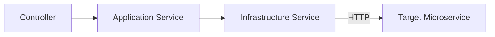

# Services

The gateway uses a **three-layer architecture**: Controller → Application Service → Infrastructure Service (HTTP proxy).

## Layer Architecture

### Application Services

These contain business logic, orchestration, and data transformation. They are injected into controllers via NestJS dependency injection.

| Service | Module | Key Responsibilities |
|---------|--------|---------------------|
| `ReceptionService` | Reception | Create/update inspections with parallel file uploads, build payloads, list with data enrichment |
| `UploadFilesService` | UploadFiles | Upload files via FormData, list with URL enrichment, stream downloads |
| `VehicleService` | Vehicle | CRUD for vehicles and all catalog types |
| `ClientsApplicationService` | Clients | CRUD for clients, document and person type catalogs |
| `AuthApplicationService` | Auth | Login, register, token validation, user management |
| `CatalogsService` | Catalogs | Read-only enum catalog proxying |
| `CatalogsCrudService` | CatalogsCrud | Unified CRUD for vehicle catalogs |

### Infrastructure Services

These handle HTTP communication with downstream microservices via `HttpService` (Axios). Each one:

1. Reads the target service base URL from environment variables
2. Provides a generic `proxyRequest(method, path, data?, headers?)` method
3. Handles connection errors and throws appropriate HTTP exceptions
4. Parses double-serialized JSON responses via `safeParse`

| Infrastructure | Target Env Var | Target Service |
|----------------|----------------|----------------|
| `ReceptionInfrastructureService` | `RECEPTION_SERVICE_BASE_URL` | Form Service |
| `UploadFilesInfrastructureService` | `UPLOAD_FILES_SERVICE_BASE_URL` | Storage Service |
| `VehicleInfrastructureService` | `VEHICLE_SERVICE_BASE_URL` | Vehicles Service |
| `ClientsInfrastructureService` | `CLIENT_SERVICE_BASE_URL` | Clients Service |
| `AuthInfrastructureService` | `AUTH_SERVICE_BASE_URL` | Auth Service |
| `CatalogsInfrastructureService` | `RECEPTION_SERVICE_BASE_URL` | Form Service |
| `CatalogsCrudInfrastructureService` | `VEHICLE_SERVICE_BASE_URL` | Vehicles Service |

### Supporting Services

| Service | Module | Description |
|---------|--------|-------------|
| `TokenValidationService` | Common | Wraps auth token validation HTTP call with error handling |
