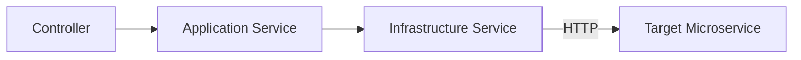

# Servicios

El gateway utiliza una **Arquitectura de tres capas**: Controlador → Servicio de Aplicación → Servicio de Infraestructura (proxy HTTP).

## Arquitectura de Capas

### Servicios de Aplicación

Estos contienen lógica de negocio, orquestación y transformación de datos. Se inyectan en los controladores a través de la inyección de dependencias de NestJS.

| Servicio | Módulo | Responsabilidades Clave |
|----------|--------|-------------------------|
| `ReceptionService` | Reception | Crear/actualizar inspecciones con cargas de archivos en paralelo, construir payloads, listar con enriquecimiento de datos |
| `UploadFilesService` | UploadFiles | Subir archivos mediante FormData, listar con enriquecimiento de URLs, descargas en streaming |
| `VehicleService` | Vehicle | CRUD para vehículos y todos los tipos de catálogo |
| `ClientsApplicationService` | Clients | CRUD para clientes, catálogos de tipos de documento y persona |
| `AuthApplicationService` | Auth | Inicio de sesión, registro, validación de token, gestión de usuarios |
| `CatalogsService` | Catalogs | Proxy de catálogo enum de solo lectura |
| `CatalogsCrudService` | CatalogsCrud | CRUD unificado para catálogos de vehículos |

### Servicios de Infraestructura

Estos manejan la comunicación HTTP con los microservicios descendentes a través de `HttpService` (Axios). Cada uno:

1. Lee la URL base del servicio objetivo desde las variables de entorno
2. Proporciona un método genérico `proxyRequest(method, path, data?, headers?)`
3. Maneja errores de conexión y lanza excepciones HTTP apropiadas
4. Analiza respuestas JSON doblemente serializadas a través de `safeParse`

| Infraestructura | Variable de Entorno Objetivo | Servicio Objetivo |
|-----------------|------------------------------|-------------------|
| `ReceptionInfrastructureService` | `RECEPTION_SERVICE_BASE_URL` | Form Service |
| `UploadFilesInfrastructureService` | `UPLOAD_FILES_SERVICE_BASE_URL` | Storage Service |
| `VehicleInfrastructureService` | `VEHICLE_SERVICE_BASE_URL` | Vehicles Service |
| `ClientsInfrastructureService` | `CLIENT_SERVICE_BASE_URL` | Clients Service |
| `AuthInfrastructureService` | `AUTH_SERVICE_BASE_URL` | Auth Service |
| `CatalogsInfrastructureService` | `RECEPTION_SERVICE_BASE_URL` | Form Service |
| `CatalogsCrudInfrastructureService` | `VEHICLE_SERVICE_BASE_URL` | Vehicles Service |

### Servicios de Apoyo

| Servicio | Módulo | Descripción |
|----------|--------|-------------|
| `TokenValidationService` | Common | Envuelve la llamada HTTP de validación de token de autenticación con manejo de errores |
