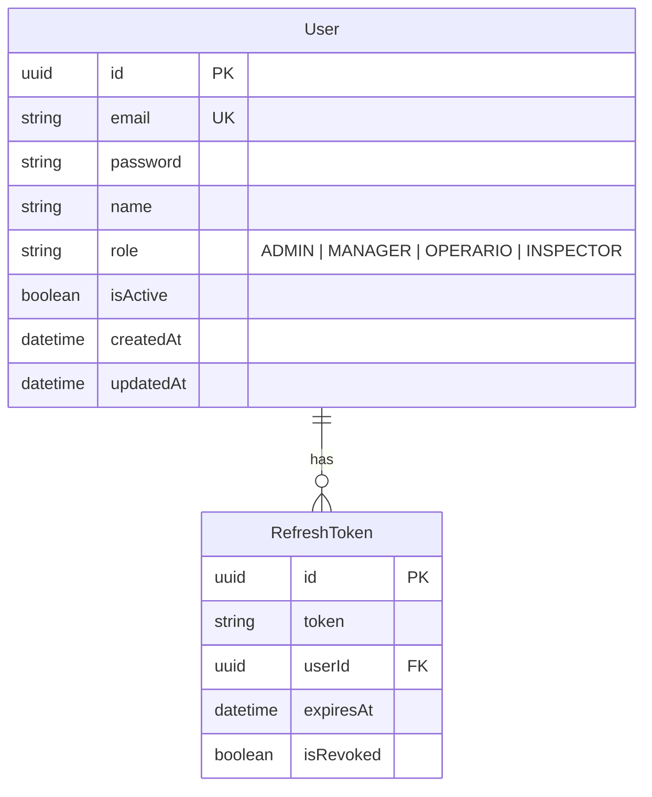
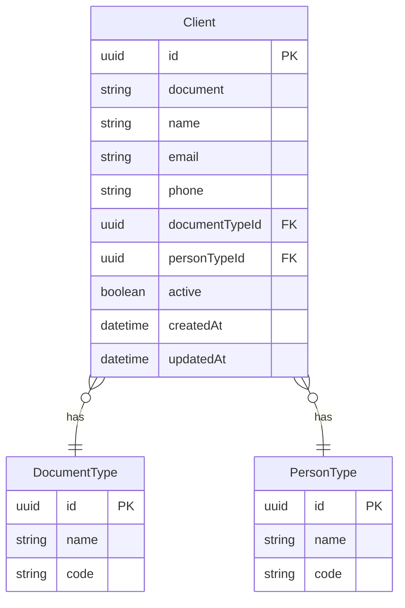
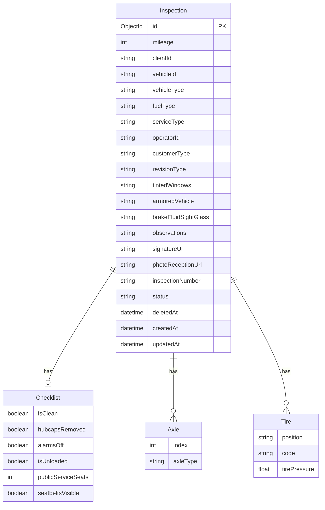
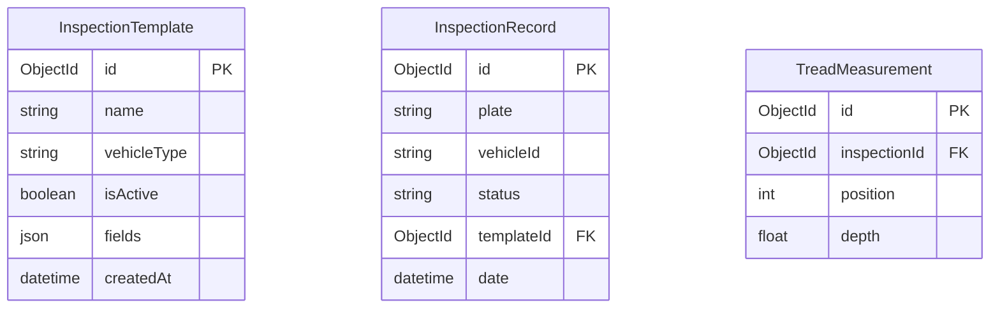
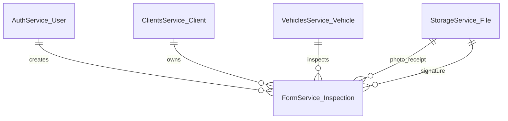

# Arquitectura de Base de Datos

El sistema utiliza **múltiples tecnologías de bases de datos** elegidas según las necesidades específicas de cada servicio:

| Servicio | Base de Datos | Tecnología | Propósito |
|---------|-------------|------------|----------|
| Auth Service | PostgreSQL | TypeORM | Usuarios, roles, tokens |
| Clients Service | PostgreSQL | Spring Data JPA + Flyway | Clientes, tipos de persona, tipos de documento |
| Vehicles Service | PostgreSQL | Spring Data JPA + Flyway | Vehículos, marcas, líneas, colores, clases |
| Form Service | MongoDB | TypeORM | Formularios de inspección, catálogos |
| Storage Service | Apache Cassandra | cassandra-driver | Metadatos de archivos y almacenamiento binario |
| Checklist Service | MongoDB | MongoEngine | Plantillas de inspección, checklists, datos de banda de rodadura |

## PostgreSQL Databases

### Auth Database (`auth_db`)



### Clients Database (`clients`)



### Vehicles Database (`vehicles`)

```mermaid
erDiagram
    Vehicle {
        uuid id PK
        string placa UK
        int modelo
        uuid marcaId FK
        uuid lineaId FK
        uuid colorId FK
        uuid claseId FK
        uuid tipoVehiculoId FK
        uuid tipoServicioId FK
        uuid tipoCombustibleId FK
        uuid clienteId
        datetime createdAt
        datetime updatedAt
    }
    Marca { uuid id PK; string nombre }
    Linea { uuid id PK; string nombre; uuid marcaId FK }
    Color { uuid id PK; string nombre }
    Clase { uuid id PK; string nombre }
    TipoVehiculo { uuid id PK; string nombre }
    TipoServicio { uuid id PK; string nombre }
    TipoCombustible { uuid id PK; string nombre }

    Vehicle }o--|| Marca : belongs_to
    Vehicle }o--|| Linea : belongs_to
    Vehicle }o--|| Color : has
    Linea }o--|| Marca : belongs_to
```

## MongoDB Databases

### Form Database (`form_service`)



### Checklist Database



## Apache Cassandra (Storage Service)

### Keyspace: `storage_system`

```sql
CREATE TABLE storage_system.files (
    id UUID PRIMARY KEY,
    filename TEXT,
    original_name TEXT,
    mime_type TEXT,
    size BIGINT,
    data BLOB,
    created_at TIMESTAMP,
    deleted_at TIMESTAMP
);

CREATE INDEX idx_files_deleted_at ON storage_system.files (deleted_at);
```

La columna `data` almacena el binario del archivo como un BLOB. `deleted_at` habilita el borrado lógico: los archivos con `deleted_at` no nulo se consideran eliminados.

## Relaciones entre Entidades (Entre Servicios)



## Migraciones

| Servicio | Herramienta | Ubicación |
|---------|-------------|----------|
| Clients Service | Flyway | `src/main/resources/db/migration/` |
| Vehicles Service | Flyway | `src/main/resources/db/migration/` |
| Auth Service | TypeORM sync | Auto-sync (development) |
| Form Service | TypeORM sync | Auto-sync (development) |
| Storage Service | Manual CQL | `scripts/` and `db/` directories |
| Checklist Service | Django migrations | `apps/*/migrations/` |
