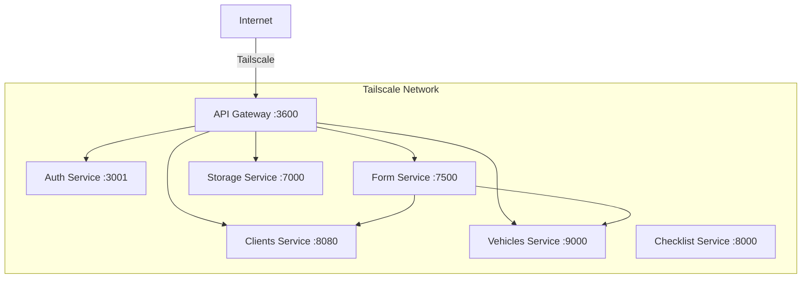

# Deployment Guide

## Architecture Overview

The system uses a **microservices architecture** where each service runs in its own Docker container. Services communicate via HTTP through the **API Gateway**, and via **RabbitMQ** for cross-service validation.



## Prerequisites

- Docker & Docker Compose
- Tailscale (for private network access)
- GitHub Container Registry (GHCR) access
- Access to the target server via SSH

## Environment Variables

Each service requires specific environment variables. Below are the minimum required for each:

### API Gateway

| Variable | Description | Required |
|----------|-------------|----------|
| `PORT` | Gateway port | Yes |
| `AUTH_SERVICE_BASE_URL` | `http://<auth-host>:3001/api` | Yes |
| `VEHICLE_SERVICE_BASE_URL` | `http://<vehicle-host>:9000` | Yes |
| `CLIENT_SERVICE_BASE_URL` | `http://<client-host>:8080` | Yes |
| `UPLOAD_FILES_SERVICE_BASE_URL` | `http://<storage-host>:7000` | Yes |
| `RECEPTION_SERVICE_BASE_URL` | `http://<form-host>:7500` | Yes |
| `API_GATEWAY_BASE_URL` | `http://<gateway-public-url>:3600` | Yes |
| `API_KEY` | Internal API key for service-to-service | Yes |
| `API_KEY_FRONT` | Frontend API key for client-to-gateway | Yes |
| `SWAGGER_USER` | Swagger UI username | No |
| `SWAGGER_PASS` | Swagger UI password | No |

### Other Services

Each service has its own `.env.example` file in its repository with the required variables.

## Deployment via GitHub Actions

The project uses **GitHub Actions** with **Tailscale** for secure deployment to private servers.

### Workflow: Docker Deploy

**File:** `.github/workflows/deploy-docker.yml`

```yaml
on:
  push:
    branches: [develop, fix/error-deploy]
  pull_request:
    branches: [main, develop]
```

The workflow:
1. Builds the Docker image
2. Pushes to GHCR (`ghcr.io/<repo>:latest` and `:<sha>`)
3. Connects via Tailscale to the target server
4. SSH into the server, pulls the image, and restarts the container

### Workflow: Docs Deploy

**File:** `.github/workflows/docs.yml`

```yaml
on:
  push:
    branches: [main]
  pull_request:
    branches: [main, develop, feat/manage-docs-basic-python]
```

Builds MkDocs documentation and deploys to **GitHub Pages** (branch `gh-pages`).

## Manual Deployment via SSH

If you need to deploy manually:

```bash
# Build the image
docker build -t api-gateway .

# Run the container
docker run -d \
  --name api-gateway \
  -p 3600:3600 \
  -e PORT=3600 \
  -e AUTH_SERVICE_BASE_URL="http://..." \
  -e API_KEY="your-api-key" \
  -e API_KEY_FRONT="your-frontend-key" \
  # ... all other env vars
  --restart unless-stopped \
  api-gateway
```

## Tailscale Configuration

Tailscale creates a **secure WireGuard-based VPN** between all services, eliminating the need for exposed public ports.

### Setup

1. Install Tailscale on each server
2. Authenticate with the same Tailscale account
3. Services communicate via Tailscale IPs or MagicDNS names
4. The gateway is accessible at `http://<tailscale-hostname>:3600`

!!! warning "Security"
    This setup relies on Tailscale for network-level access control. If you deploy without Tailscale, you **must** configure proper firewall rules, TLS certificates, and CORS policies manually.

## Docker Compose (Local Development)

```yaml
version: '3.8'
services:
  postgres:
    image: postgres:16
    environment:
      POSTGRES_DB: form_database
      POSTGRES_USER: user
      POSTGRES_PASSWORD: pass
    ports:
      - "5432:5432"

  minio:
    image: minio/minio
    command: server /data --console-address ":9001"
    ports:
      - "9000:9000"
      - "9001:9001"

  api-gateway:
    build: .
    ports:
      - "3600:3600"
    env_file: .env
    depends_on:
      - postgres
```

## Health Checks

Each service exposes a health endpoint:

| Service | Health Endpoint |
|---------|----------------|
| API Gateway | `GET /` |
| Form Service | `GET /api/` |
| Storage Service | `GET /` |
| Vehicles Service | `GET /api/v1/health` |
