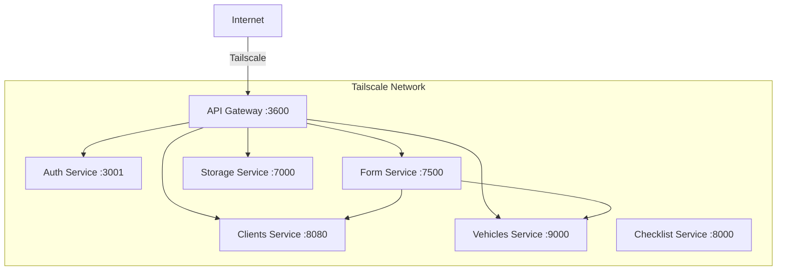

# Guía de Despliegue

## Visión General de la Arquitectura

El sistema utiliza una **arquitectura de microservicios** donde cada servicio se ejecuta en su propio contenedor Docker. Los servicios se comunican vía HTTP a través del **API Gateway**, y vía **RabbitMQ** para validación entre servicios.



## Requisitos Previos

- Docker y Docker Compose
- Tailscale (para acceso a red privada)
- Acceso a GitHub Container Registry (GHCR)
- Acceso al servidor de destino vía SSH

## Variables de Entorno

Cada servicio requiere variables de entorno específicas. A continuación se muestran las mínimas requeridas para cada uno:

### API Gateway

| Variable | Descripción | Requerida |
|----------|-------------|-----------|
| `PORT` | Puerto del Gateway | Sí |
| `AUTH_SERVICE_BASE_URL` | `http://<auth-host>:3001/api` | Sí |
| `VEHICLE_SERVICE_BASE_URL` | `http://<vehicle-host>:9000` | Sí |
| `CLIENT_SERVICE_BASE_URL` | `http://<client-host>:8080` | Sí |
| `UPLOAD_FILES_SERVICE_BASE_URL` | `http://<storage-host>:7000` | Sí |
| `RECEPTION_SERVICE_BASE_URL` | `http://<form-host>:7500` | Sí |
| `API_GATEWAY_BASE_URL` | `http://<gateway-public-url>:3600` | Sí |
| `API_KEY` | Clave API interna para comunicación entre servicios | Sí |
| `API_KEY_FRONT` | Clave API del frontend para comunicación cliente-gateway | Sí |
| `SWAGGER_USER` | Nombre de usuario de Swagger UI | No |
| `SWAGGER_PASS` | Contraseña de Swagger UI | No |

### Otros Servicios

Cada servicio tiene su propio archivo `.env.example` en su repositorio con las variables requeridas.

## Despliegue mediante GitHub Actions

El proyecto utiliza **GitHub Actions** con **Tailscale** para el despliegue seguro en servidores privados.

### Workflow: Docker Deploy

**Archivo:** `.github/workflows/deploy-docker.yml`

```yaml
on:
  push:
    branches: [develop, fix/error-deploy]
  pull_request:
    branches: [main, develop]
```

El workflow:
1. Construye la imagen Docker
2. La envía a GHCR (`ghcr.io/<repo>:latest` y `:<sha>`)
3. Se conecta vía Tailscale al servidor de destino
4. Accede por SSH al servidor, descarga la imagen y reinicia el contenedor

### Workflow: Despliegue de Documentación

**Archivo:** `.github/workflows/docs.yml`

```yaml
on:
  push:
    branches: [main]
  pull_request:
    branches: [main, develop, feat/manage-docs-basic-python]
```

Construye la documentación MkDocs y la despliega en **GitHub Pages** (rama `gh-pages`).

## Despliegue Manual mediante SSH

Si necesitas desplegar manualmente:

```bash
# Build the image
docker build -t api-gateway .

# Run the container
docker run -d \
  --name api-gateway \
  -p 3600:3600 \
  -e PORT=3600 \
  -e AUTH_SERVICE_BASE_URL="http://..." \
  -e API_KEY="your-api-key" \
  -e API_KEY_FRONT="your-frontend-key" \
  # ... all other env vars
  --restart unless-stopped \
  api-gateway
```

## Configuración de Tailscale

Tailscale crea una **VPN segura basada en WireGuard** entre todos los servicios, eliminando la necesidad de exponer puertos públicos.

### Configuración

1. Instala Tailscale en cada servidor
2. Autentícate con la misma cuenta de Tailscale
3. Los servicios se comunican mediante IPs de Tailscale o nombres MagicDNS
4. El gateway es accesible en `http://<tailscale-hostname>:3600`

!!! warning "Seguridad"
    Esta configuración depende de Tailscale para el control de acceso a nivel de red. Si despliegas sin Tailscale, **debes** configurar manualmente las reglas de firewall, certificados TLS y políticas CORS adecuadas.

## Docker Compose (Desarrollo Local)

```yaml
version: '3.8'
services:
  postgres:
    image: postgres:16
    environment:
      POSTGRES_DB: form_database
      POSTGRES_USER: user
      POSTGRES_PASSWORD: pass
    ports:
      - "5432:5432"

  minio:
    image: minio/minio
    command: server /data --console-address ":9001"
    ports:
      - "9000:9000"
      - "9001:9001"

  api-gateway:
    build: .
    ports:
      - "3600:3600"
    env_file: .env
    depends_on:
      - postgres
```

## Verificaciones de Salud

Cada servicio expone un endpoint de salud:

| Servicio | Endpoint de Salud |
|---------|----------------|
| API Gateway | `GET /` |
| Form Service | `GET /api/` |
| Storage Service | `GET /` |
| Vehicles Service | `GET /api/v1/health` |
