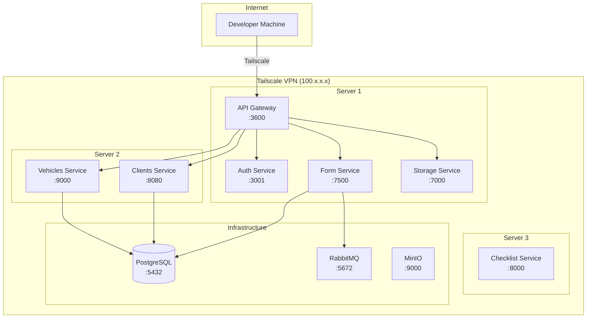

# Network Architecture

## Overview

The system is deployed across a **Tailscale VPN network** that provides secure, encrypted communication between all services without exposing ports to the public internet.



## Tailscale Configuration

### What is Tailscale?

Tailscale creates a **WireGuard-based mesh VPN** where each machine gets a unique IP (`100.x.x.x`) and can communicate directly with any other machine in the network.

### Why Tailscale?

- **Zero public ports** ÔÇö Services are not exposed to the internet
- **Encrypted by default** ÔÇö All traffic is encrypted via WireGuard
- **Simple authentication** ÔÇö Uses SSO (Google, GitHub, Microsoft, etc.)
- **MagicDNS** ÔÇö Machines can be referenced by hostname instead of IP

### Setup

1. Install Tailscale on each server:
   ```bash
   curl -fsSL https://tailscale.com/install.sh | sh
   ```

2. Authenticate each node:
   ```bash
   sudo tailscale up --authkey=<your-auth-key>
   ```

3. Verify connectivity:
   ```bash
   tailscale status
   ```

### GitHub Actions Integration

The CI/CD pipeline uses the `tailscale/github-action@v2` action to connect the GitHub runner to the Tailscale network during deployment:

```yaml
- name: Tailscale
  uses: tailscale/github-action@v2
  with:
    authkey: ${{ secrets.TAILSCALE_AUTHKEY }}
```

This allows the runner to SSH into the target server and deploy containers without exposing any ports.

## Port Reference

### Application Ports

| Service | Port | Protocol | Tailscale Only |
|---------|------|----------|----------------|
| API Gateway | `3600` | HTTP | Yes |
| Auth Service | `3001` | HTTP | Yes |
| Clients Service | `8080` | HTTP | Yes |
| Vehicles Service | `9000` | HTTP | Yes |
| Form Service | `7500` | HTTP | Yes |
| Storage Service | `7000` | HTTP | Yes |
| Checklist Service | `8000` | HTTP | Yes |

### Infrastructure Ports

| Service | Port | Protocol | Tailscale Only |
|---------|------|----------|----------------|
| PostgreSQL | `5432` | TCP | Yes |
| RabbitMQ AMQP | `5672` | TCP | Yes |
| RabbitMQ Admin | `15672` | HTTP | Yes |
| MinIO API | `9000` | HTTP | Yes |
| MinIO Console | `9001` | HTTP | Yes |

## Deploying Without Tailscale (Open Network)

If you deploy in an environment without Tailscale:

1. **Modify the CI workflow** ÔÇö Remove the Tailscale step and use direct SSH or a different VPN
2. **Configure TLS** ÔÇö Set up HTTPS certificates for all public endpoints
3. **Enable CORS** ÔÇö Uncomment CORS configuration in the gateway's `main.ts`
4. **Firewall rules** ÔÇö Restrict access to infrastructure ports (PostgreSQL, RabbitMQ)
5. **API Key security** ÔÇö Ensure all services validate the `x-api-key` header
6. **Service discovery** ÔÇö Replace Tailscale IPs/Hostnames with actual server addresses

## DNS Resolution

Services resolve each other via:
- **Tailscale MagicDNS** ÔÇö `machine-name.tailscale-xxxx.ts.net`
- **Tailscale IPs** ÔÇö `100.x.x.x`
- **Environment variables** ÔÇö Each service's `*_BASE_URL` env var defines the target address

!!! example
    ```env
    AUTH_SERVICE_BASE_URL=http://100.1.2.3:3001/api
    VEHICLE_SERVICE_BASE_URL=http://auth-server:9000
    ```
