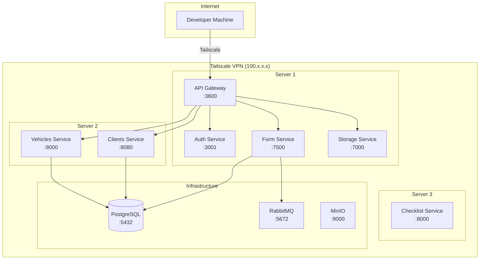

# Arquitectura de Red

## Visión General

El sistema está desplegado a través de una **red VPN de Tailscale** que proporciona comunicación segura y cifrada entre todos los servicios sin exponer puertos a internet público.



## Configuración de Tailscale

### ¿Qué es Tailscale?

Tailscale crea una **VPN en malla basada en WireGuard** donde cada máquina obtiene una IP única (`100.x.x.x`) y puede comunicarse directamente con cualquier otra máquina en la red.

### ¿Por qué Tailscale?

- **Cero puertos públicos** — Los servicios no están expuestos a internet
- **Cifrado por defecto** — Todo el tráfico está cifrado mediante WireGuard
- **Autenticación simple** — Utiliza SSO (Google, GitHub, Microsoft, etc.)
- **MagicDNS** — Las máquinas pueden ser referenciadas por nombre de host en lugar de IP

### Configuración

1. Instala Tailscale en cada servidor:
   ```bash
   curl -fsSL https://tailscale.com/install.sh | sh
   ```

2. Autentica cada nodo:
   ```bash
   sudo tailscale up --authkey=<your-auth-key>
   ```

3. Verifica la conectividad:
   ```bash
   tailscale status
   ```

### Integración con GitHub Actions

El pipeline de CI/CD utiliza la acción `tailscale/github-action@v2` para conectar el runner de GitHub a la red de Tailscale durante el despliegue:

```yaml
- name: Tailscale
  uses: tailscale/github-action@v2
  with:
    authkey: ${{ secrets.TAILSCALE_AUTHKEY }}
```

Esto permite que el runner acceda por SSH al servidor de destino y despliegue contenedores sin exponer ningún puerto.

## Referencia de Puertos

### Puertos de Aplicación

| Servicio | Puerto | Protocolo | Solo Tailscale |
|---------|-------|-----------|----------------|
| API Gateway | `3600` | HTTP | Sí |
| Auth Service | `3001` | HTTP | Sí |
| Clients Service | `8080` | HTTP | Sí |
| Vehicles Service | `9000` | HTTP | Sí |
| Form Service | `7500` | HTTP | Sí |
| Storage Service | `7000` | HTTP | Sí |
| Checklist Service | `8000` | HTTP | Sí |

### Puertos de Infraestructura

| Servicio | Puerto | Protocolo | Solo Tailscale |
|---------|-------|-----------|----------------|
| PostgreSQL | `5432` | TCP | Sí |
| RabbitMQ AMQP | `5672` | TCP | Sí |
| RabbitMQ Admin | `15672` | HTTP | Sí |
| MinIO API | `9000` | HTTP | Sí |
| MinIO Console | `9001` | HTTP | Sí |

## Despliegue sin Tailscale (Red Abierta)

Si despliegas en un entorno sin Tailscale:

1. **Modifica el workflow de CI** — Elimina el paso de Tailscale y usa SSH directo o una VPN diferente
2. **Configura TLS** — Configura certificados HTTPS para todos los endpoints públicos
3. **Habilita CORS** — Descomenta la configuración CORS en `main.ts` del gateway
4. **Reglas de firewall** — Restringe el acceso a los puertos de infraestructura (PostgreSQL, RabbitMQ)
5. **Seguridad de API Key** — Asegúrate de que todos los servicios validen el encabezado `x-api-key`
6. **Descubrimiento de servicios** — Reemplaza las IPs/hostnames de Tailscale con las direcciones reales de los servidores

## Resolución DNS

Los servicios se resuelven entre sí mediante:
- **Tailscale MagicDNS** — `machine-name.tailscale-xxxx.ts.net`
- **IPs de Tailscale** — `100.x.x.x`
- **Variables de entorno** — La variable de entorno `*_BASE_URL` de cada servicio define la dirección de destino

!!! example
    ```env
    AUTH_SERVICE_BASE_URL=http://100.1.2.3:3001/api
    VEHICLE_SERVICE_BASE_URL=http://auth-server:9000
    ```
