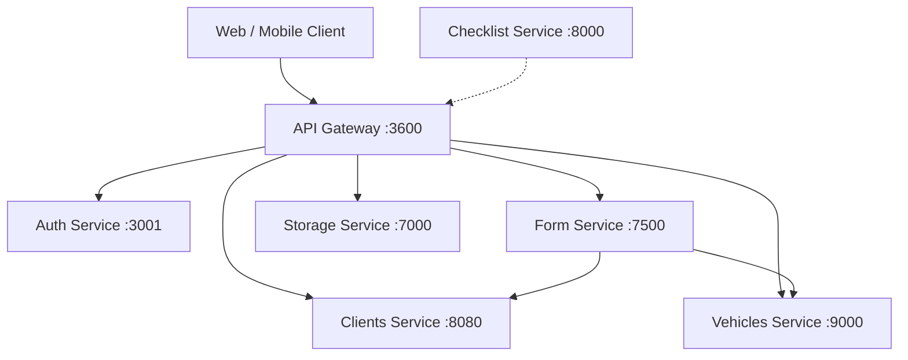

# CDA System - API Gateway

Welcome to the **API Gateway** documentation for the CDA vehicle inspection system.

## Architecture Overview

The system follows a **microservices architecture** where an **API Gateway** (NestJS) acts as the single entry point for all client requests. Each backend concern is delegated to a dedicated microservice:

## Service Matrix

| Service | Port | Tech | Database |
|---------|------|------|----------|
| API Gateway | `3600` | NestJS 11 | - |
| Auth Service | `3001` | NestJS 11 | PostgreSQL + Redis |
| Clients Service | `8080` | Spring Boot 4 / Java 17 | PostgreSQL |
| Vehicles Service | `9000` | Spring Boot 4 / Java 17 | PostgreSQL |
| Form Service | `7500` | NestJS 11 | MongoDB |
| Storage Service | `7000` | NestJS 11 | Apache Cassandra |
| Checklist Service | `8000` | Django 6 / Python 3.12 | MongoDB |

## Key Features

- **Centralized Authentication** ÔÇö JWT access/refresh tokens with role-based access control
- **File Upload & Storage** ÔÇö Multi-part file uploads stored in Apache Cassandra with MinIO-style access
- **Vehicle Inspection Flow** ÔÇö End-to-end reception form with checklists, tire measurements, and photo evidence
- **Unified Catalogs** ÔÇö Dynamic CRUD for vehicle brands, lines, colors, types, and more
- **Cross-Service Validation** ÔÇö RabbitMQ RPC for validating client and vehicle existence before form submission
- **API Key Security** ÔÇö Internal microservice-to-microservice communication secured via shared API keys

## Swagger Documentation

Each service exposes its own Swagger UI:

| Service | Swagger URL |
|---------|-------------|
| API Gateway | `{API_GATEWAY_BASE_URL}/docs` |
| Form Service | `{RECEPTION_SERVICE_BASE_URL}/docs` |
| Storage Service | `{UPLOAD_FILES_SERVICE_BASE_URL}/docs` |
| Auth Service | `{AUTH_SERVICE_BASE_URL}/docs` _(if available)_ |
| Clients Service | `{CLIENT_SERVICE_BASE_URL}/swagger-ui.html` |
| Vehicles Service | `{VEHICLE_SERVICE_BASE_URL}/swagger-ui.html` _(if available)_ |

!!! tip "Base URLs"
    Replace the placeholders with the actual deployed URLs. In production, these are injected via environment variables.
