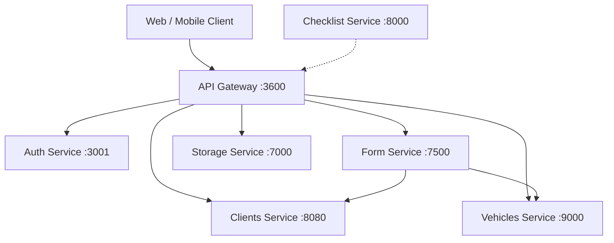

# CDA System - API Gateway

Bienvenido a la documentación del **API Gateway** del sistema de inspección vehicular CDA.

## Descripción general de la arquitectura

El sistema sigue una **arquitectura de microservicios** donde un **API Gateway** (NestJS) actúa como el punto de entrada único para todas las solicitudes de los clientes. Cada componente de backend se delega a un microservicio dedicado:

## Matriz de servicios

| Servicio | Puerto | Tecnología | Base de datos |
|----------|--------|------------|---------------|
| API Gateway | `3600` | NestJS 11 | - |
| Auth Service | `3001` | NestJS 11 | PostgreSQL + Redis |
| Clients Service | `8080` | Spring Boot 4 / Java 17 | PostgreSQL |
| Vehicles Service | `9000` | Spring Boot 4 / Java 17 | PostgreSQL |
| Form Service | `7500` | NestJS 11 | MongoDB |
| Storage Service | `7000` | NestJS 11 | Apache Cassandra |
| Checklist Service | `8000` | Django 6 / Python 3.12 | MongoDB |

## Características principales

- **Autenticación centralizada** — Tokens JWT access/refresh con control de acceso basado en roles
- **Carga y almacenamiento de archivos** — Cargas de archivos multiparte almacenadas en Apache Cassandra con acceso estilo MinIO
- **Flujo de inspección vehicular** — Formulario de recepción de extremo a extremo con checklists, mediciones de neumáticos y evidencia fotográfica
- **Catálogos unificados** — CRUD dinámico para marcas, líneas, colores, tipos de vehículo y más
- **Validación entre servicios** — RabbitMQ RPC para validar la existencia del cliente y vehículo antes del envío del formulario
- **Seguridad con API Key** — Comunicación interna entre microservicios asegurada mediante API keys compartidas

## Documentación Swagger

Cada servicio expone su propia interfaz Swagger UI:

| Servicio | URL de Swagger |
|----------|----------------|
| API Gateway | `{API_GATEWAY_BASE_URL}/docs` |
| Form Service | `{RECEPTION_SERVICE_BASE_URL}/docs` |
| Storage Service | `{UPLOAD_FILES_SERVICE_BASE_URL}/docs` |
| Auth Service | `{AUTH_SERVICE_BASE_URL}/docs` _(si está disponible)_ |
| Clients Service | `{CLIENT_SERVICE_BASE_URL}/swagger-ui.html` |
| Vehicles Service | `{VEHICLE_SERVICE_BASE_URL}/swagger-ui.html` _(si está disponible)_ |

!!! tip "URLs base"
    Reemplace los placeholders con las URLs reales desplegadas. En producción, estas se inyectan mediante variables de entorno.
